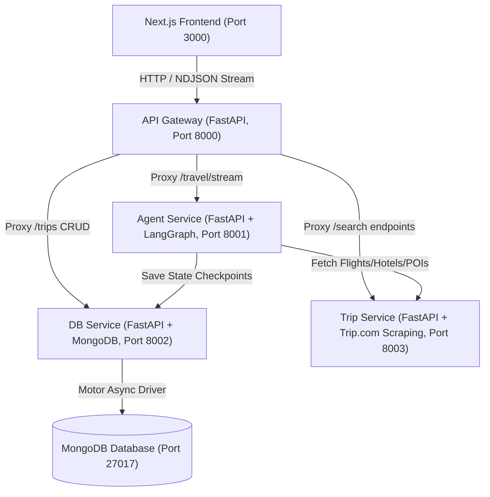
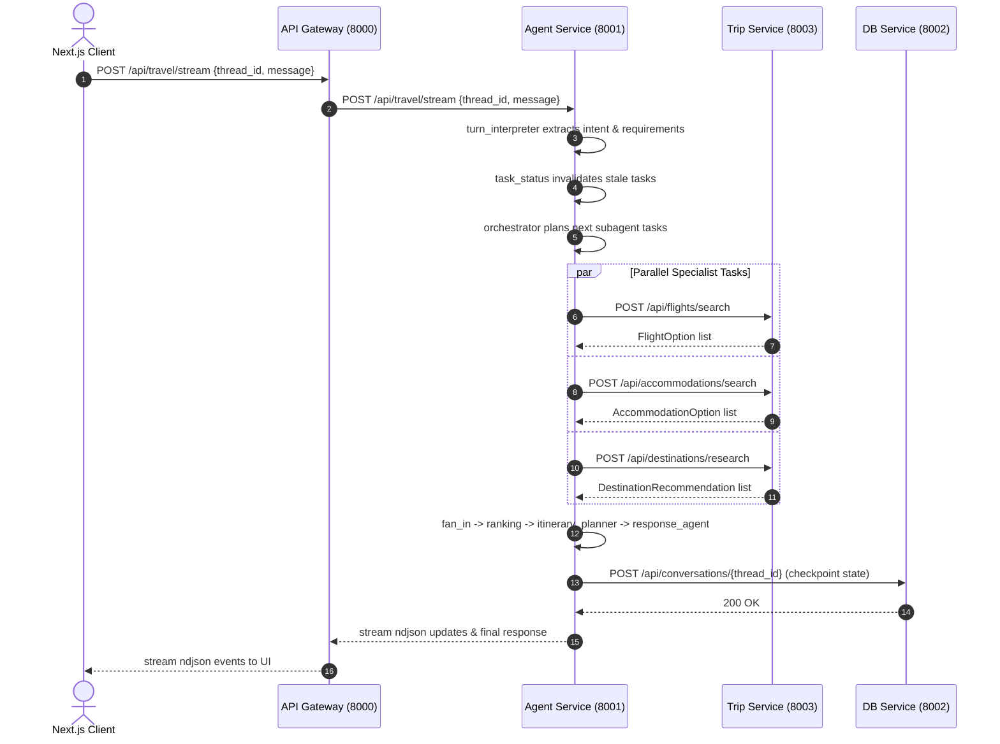

# Travel Planner Microservices Architecture

This document describes the architectural topology, service responsibilities, and communication patterns of the `travel-planner` backend.

---

## Service Overview

### 1. Gateway (`services/gateway`, Port `8000`)
- **Role**: Single entrypoint for external clients (Next.js web app / mobile).
- **Key Responsibilities**:
  - Routing and request forwarding.
  - CORS header handling.
  - Streaming pass-through (`x-ndjson`) from the LangGraph agent to the client.
  - Aggregated system health checks.

### 2. Agent Service (`services/agent-service`, Port `8001`)
- **Role**: Intelligent agent orchestration engine.
- **Key Responsibilities**:
  - LangGraph state machine execution (`turn_interpreter` -> `task_status` -> `orchestrator` -> specialists -> `ranking` -> `itinerary_planner` -> `response_agent`).
  - Deterministic dependency invalidation (marking tasks `stale` when inputs change).
  - Multi-turn conversation management with checkpointing.
  - Inter-service communication with `trip-service` for data gathering and `db-service` for persistence.

### 3. DB Service (`services/db-service`, Port `8002`)
- **Role**: Persistence and state store.
- **Key Responsibilities**:
  - MongoDB CRUD operations using the asynchronous `motor` driver.
  - Storage for saved trips, itinerary days, bookmarks, and conversation thread checkpoints.

### 4. Trip Service (`services/trip-service`, Port `8003`)
- **Role**: Travel data provider adapter.
- **Key Responsibilities**:
  - Real-time / mock scraping for flights and hotels on Trip.com.
  - Destination POI and cultural recommendations.
  - Isolated dependency boundary (BeautifulSoup, scraping logic, rate-limiting guards).

---

## Inter-Service Interaction Flow

